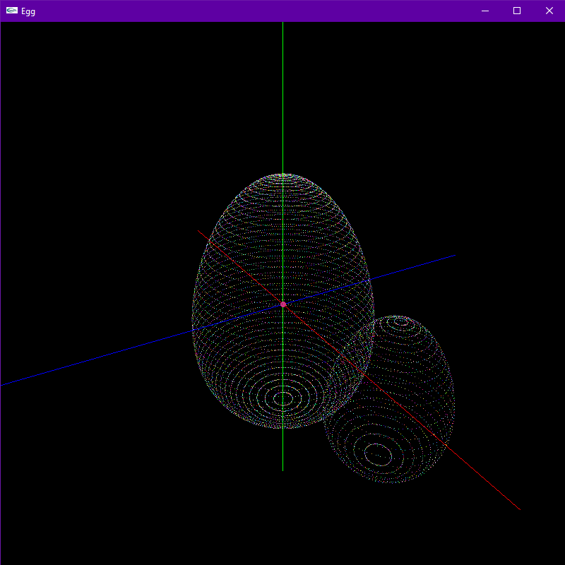
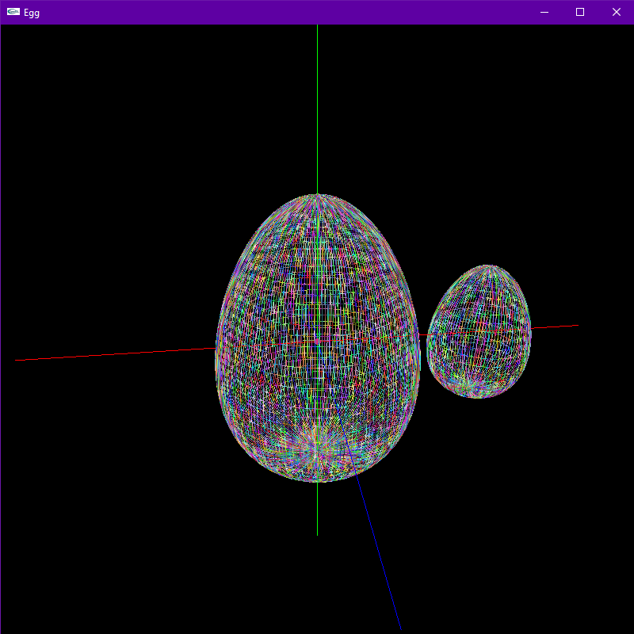
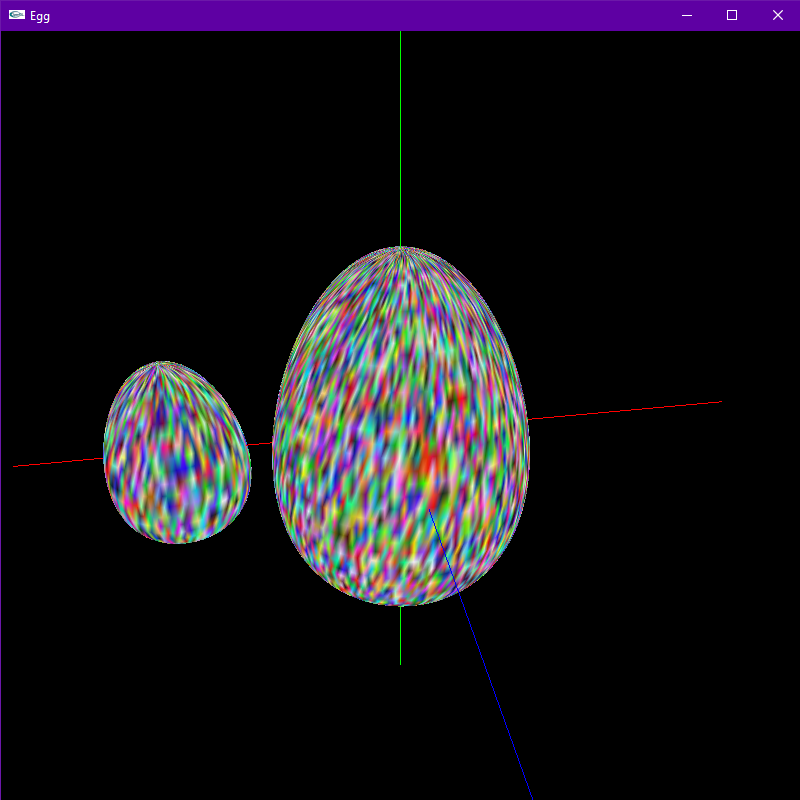
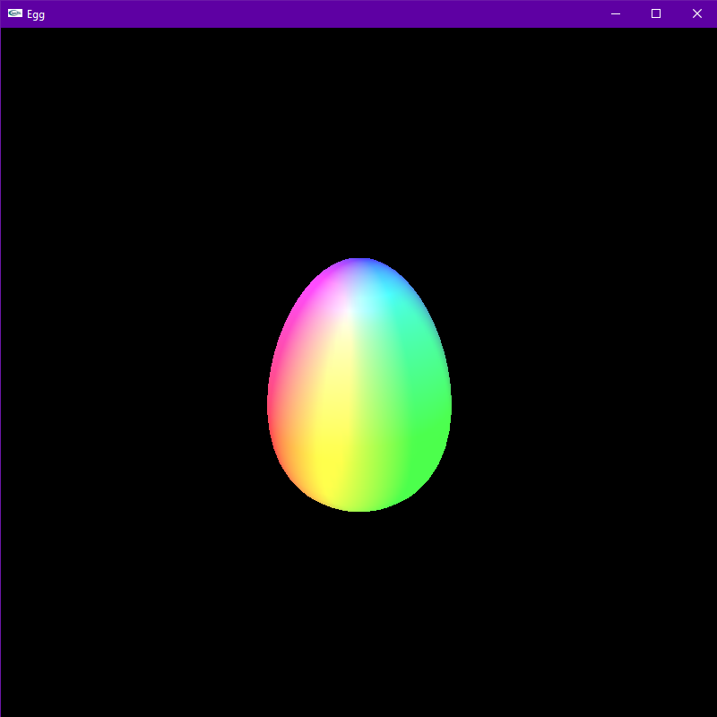
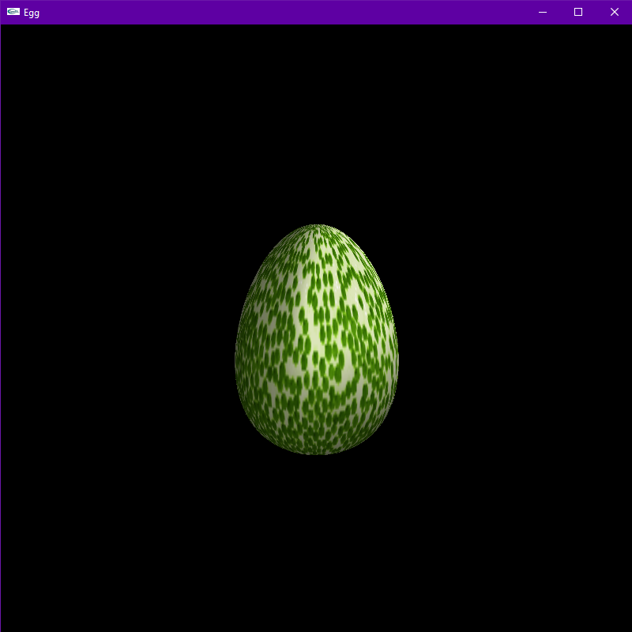
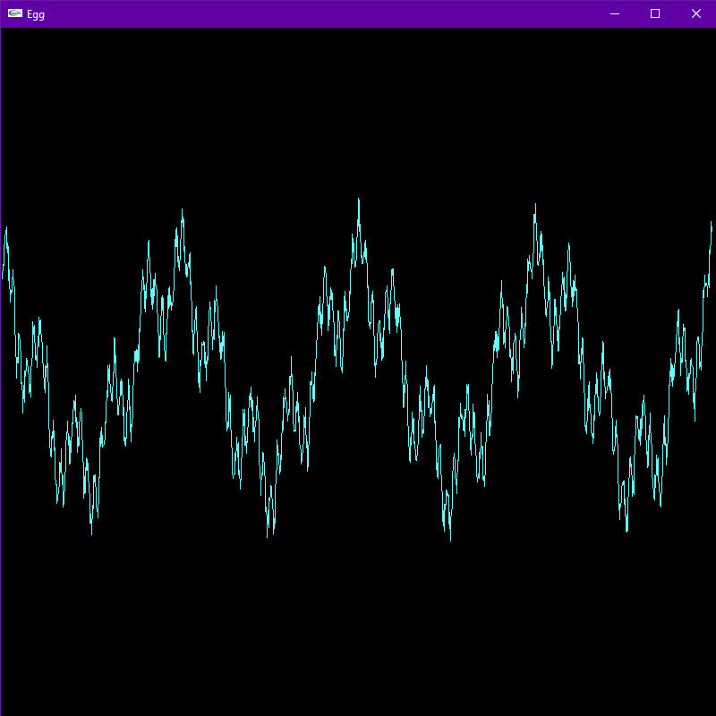
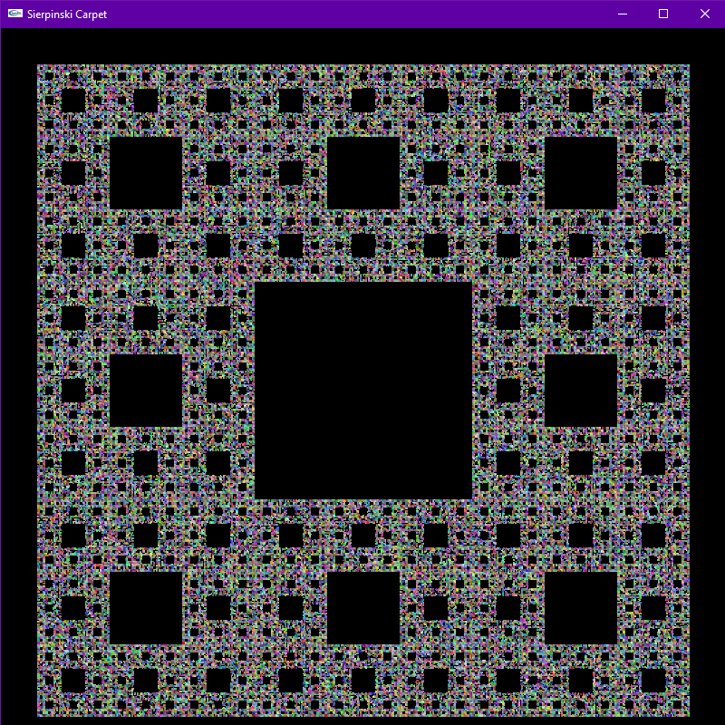

# Graphics OpenGL
> A collection of a few simple OpenGL programs.

## Table of contents
- [Graphics OpenGL](#graphics-opengl)
  - [Table of contents](#table-of-contents)
  - [General info](#general-info)
  - [Screenshots](#screenshots)
  - [Technologies](#technologies)
  - [Setup and run](#setup-and-run)
  - [Features](#features)
  - [Status](#status)
  - [Contact](#contact)

## General info
Repository contains 6 projects made with C++ and glut 3.7 library. "Egg" projects were developed in following order: egg -> egg2 -> ligting -> textures, so each "next" project is based on "previous" project. "Sierpinski_carpet" and "weierstrass_function" are two independent projects. The purpose of this projcet was to learn basics of OpenGL and computer graphics in general.

## Screenshots
| | | |
|:---:|:---:|:---:|
| | | |

| | |
|:---:|:---:|
| | |

| | |
|:---:|:---:|
| | |

## Technologies
All programs are made using C++ and [glut 3.7](https://www.opengl.org/resources/libraries/glut/spec3/spec3.html) library.

## Setup and run
In order to compile, you have to install glut 3.7 library first. Then just download cpp files and use any C++ compiler (developed using Visual Studio 2019).

## Features
List of features:
* egg
```
CONTROLS:
- "L", "P", "T" - draw eggs as Lines / Points / Triangles.
- "X", "Y", "Z" - spin and rotate eggs around X / Y / Z axis.
- "S" - stop rotation and spin and reset position.
- "D" - change direction of spin and rotation.
- "A" - enable/disable axes.
- "1", "2" - rotate view position X.
- "3", "4" - rotate view position Y.
- "5", "6" - rotate view position Z.
- "0" - reset view position.
```
* egg2
```
CONTROLS:
- "L", "P", "T" - draw eggs as Lines / Points / Triangles.
- "X", "Y", "Z" - spin and rotate eggs around X / Y / Z axis.
- "S" - stop rotation and spin and reset position.
- "D" - change direction of spin and rotation.
- "A" - enable/disable axes.
- "LMB + MOUSE_MOVE_X" - move observer left/right.
- "RMB + MOUSE_MOVE_X/MOUSE_MOVE_Y" - rotate observer spherically.
- "MMB + MOUSE_MOVE_Y" - zoom in/out.
- "R" - reset observer position.
```
* Ligting
```
CONTROLS:
- "1"/"2" - Enable/Disable Light0.
- "3"/"4" - Enable/Disable Light1.
- "5"/"6" - Enable/Disable Light2.
- "7"/"8" - Enable/Disable Light3.
- "9"/"0" - Enable/Disable Light4.
- "R" - Pick random color for Light4.
      (I recommend to hold R for disco-efect)
- "X", "Y", "Z" - Rotate egg around X/Y/Z axis.
- "S" - Stop rotation.
- "LMB" + "MouseX/Y" - Move Light4.
- "MMB" + "MouseX/Y" - Move Ligth4 closer/further.
- "RMB" + "MouseX/Y" - Move observer (camera).
```
* textures
```
CONTROLS:
- "1"/"2" - Enable/Disable Light0.
- "3"/"4" - Enable/Disable Light4.
- "R" - Pick random color for Light4.
	(I recommend to hold R for disco-efect)
- "X", "Y", "Z" - Rotate egg around X/Y/Z axis.
- "S" - Stop rotation.
- "LMB" + "MouseX/Y" - Move Light4.
- "MMB" + "MouseX/Y" - Move Ligth4 closer/further.
- "RMB" + "MouseX/Y" - Move observer (camera).
```
* weierstrass_function
```
CONTROLS:
- "LMB + MOUSE MOVE X" - move camera X.
- "RMB + MOUSE MOVE Y" - move camera Y.
- "MMB + MOUSE MOVE Y" - zoom in/out.
- "R" - reset view.
- "A" - enable/disable axes.
```
* sierpiniski_carpet - no special features.

## Status
This project is finished and no longer developed.

## Contact
Created by [@michaltkacz](https://github.com/michaltkacz) - feel free to contact me!